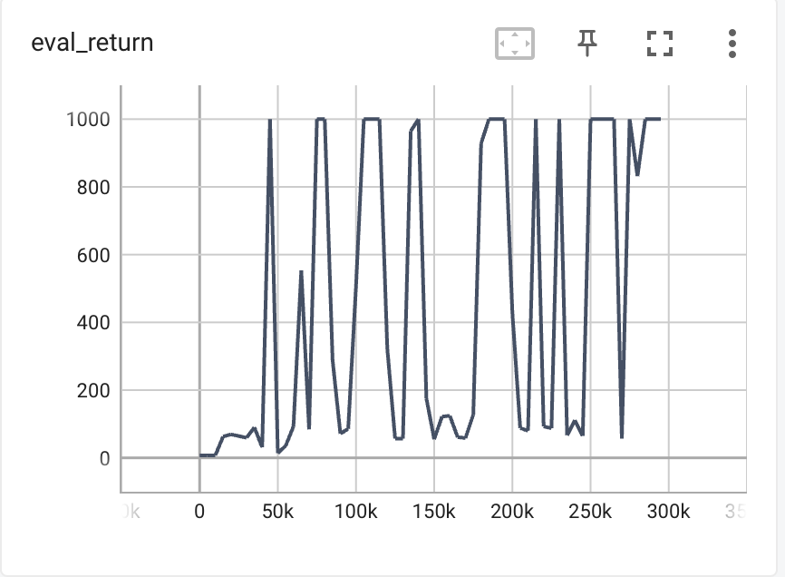
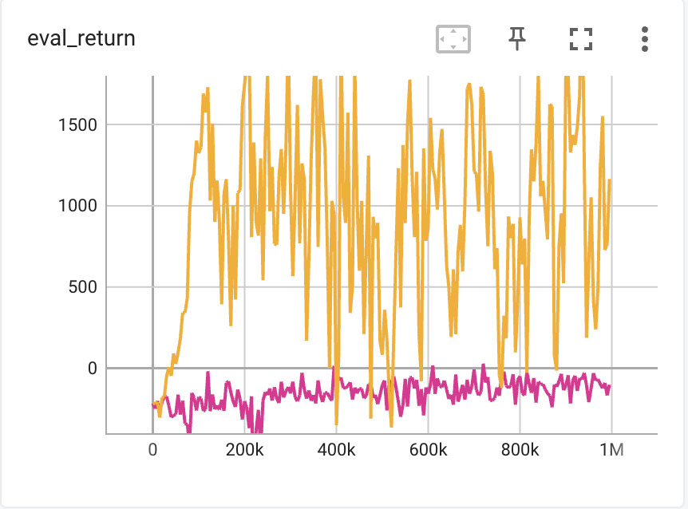
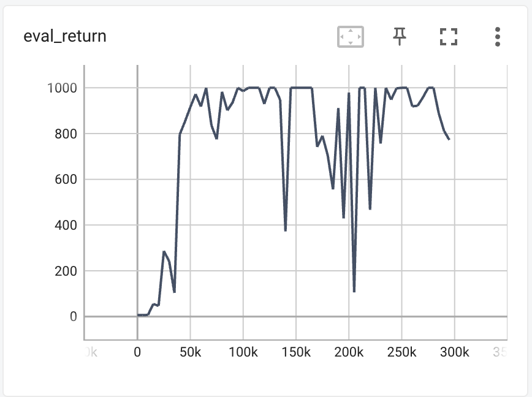
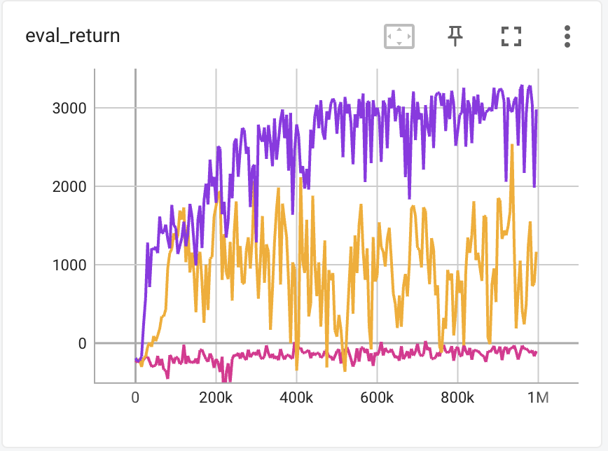
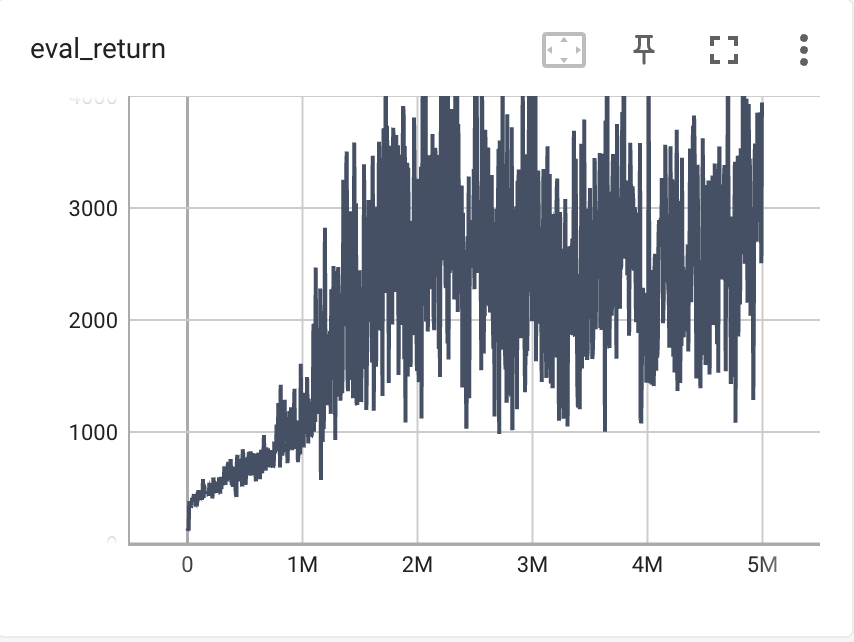
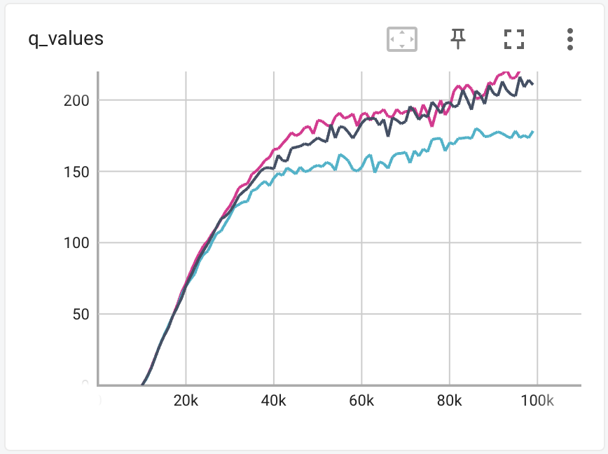
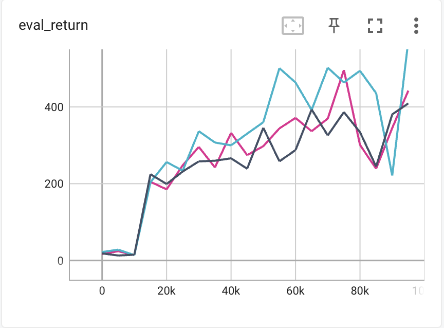

# DQN
## Basice Q-Learning
### Deliverables 1: DQN on CartPole-v1
```shell
python cs285/scripts/run_hw3_dqn.py -cfg experiments/dqn/cartpole.yaml
```

### Deliverables 2: DQN on LunarLander-v2
```shell
python cs285/scripts/run_hw3_dqn.py -cfg experiments/dqn/lunarlander.yaml --seed 1
python cs285/scripts/run_hw3_dqn.py -cfg experiments/dqn/lunarlander.yaml --seed 2
python cs285/scripts/run_hw3_dqn.py -cfg experiments/dqn/lunarlander.yaml --seed 3
```

## Double Q-Learning
### Deliverables 3: Double DQN on lunar lander problem
```shell
python cs285/scripts/run_hw3_dqn.py -cfg experiments/dqn/lunarlander_doubleq.yaml --
    seed 1
python cs285/scripts/run_hw3_dqn.py -cfg experiments/dqn/lunarlander_doubleq.yaml --
    seed 2
python cs285/scripts/run_hw3_dqn.py -cfg experiments/dqn/lunarlander_doubleq.yaml --
    seed 3
```

### Deliverables 4: Double DQN on MsPacman-v0 problem.
```shell
python cs285/scripts/run_hw3_dqn.py -cfg experiments/dqn/mspacman.yaml
```

# Continuous Actions with Actor-Critic
## Actor with Reinforce
```shell
python cs285/scripts/run_hw3_sac.py -cfg experiments/sac/sanity_invertedpendulum_reinforce.yaml
```

### Deliverables 5: Actor with Reinforce on halfcheetah
```shell
python cs285/scripts/run_hw3_sac.py -cfg experiments/sac/halfcheetah_reinforce1.yaml
python cs285/scripts/run_hw3_sac.py -cfg experiments/sac/halfcheetah_reinforce10.yaml
```


We can see from the graph that configuration takes many samples from the actor for computing the REINFORCE gradient performs better than the one with only 1 sample.
## Actor with REPARAMETRIZE
```shell
python cs285/scripts/run_hw3_sac.py -cfg experiments/sac/sanity_invertedpendulum_reparametrize.yaml
```

### Deliverables 6: Actor with REPARAMETRIZE on halfcheetah
```shell
python cs285/scripts/run_hw3_sac.py -cfg experiments/sac/halfcheetah_reparametrize.yaml
```

### Deliverables 7: Actor with REPARAMETRIZE on Humanoid-v4
```shell
python cs285/scripts/run_hw3_sac.py -cfg experiments/sac/humanoid.yaml
```

## Stabilizing Target Values
### Deliverables 8: Run single-Q, double-Q, and clipped double-Q on Hopper-v4
```shell
python cs285/scripts/run_hw3_sac.py -cfg experiments/sac/hopper.yaml
python cs285/scripts/run_hw3_sac.py -cfg experiments/sac/hopper_doubleq.yaml
python cs285/scripts/run_hw3_sac.py -cfg experiments/sac/hopper_clipq.yaml
```




where black represents single-Q, pink represents double-Q, blue represents clipped double-Q.