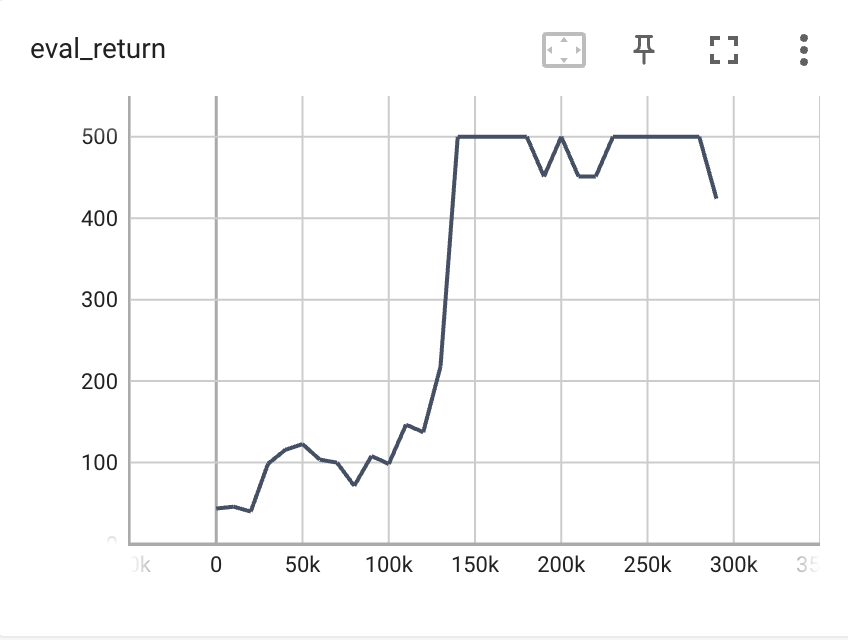
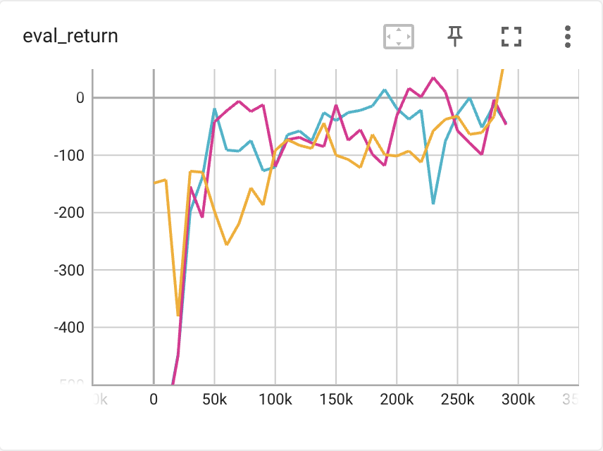
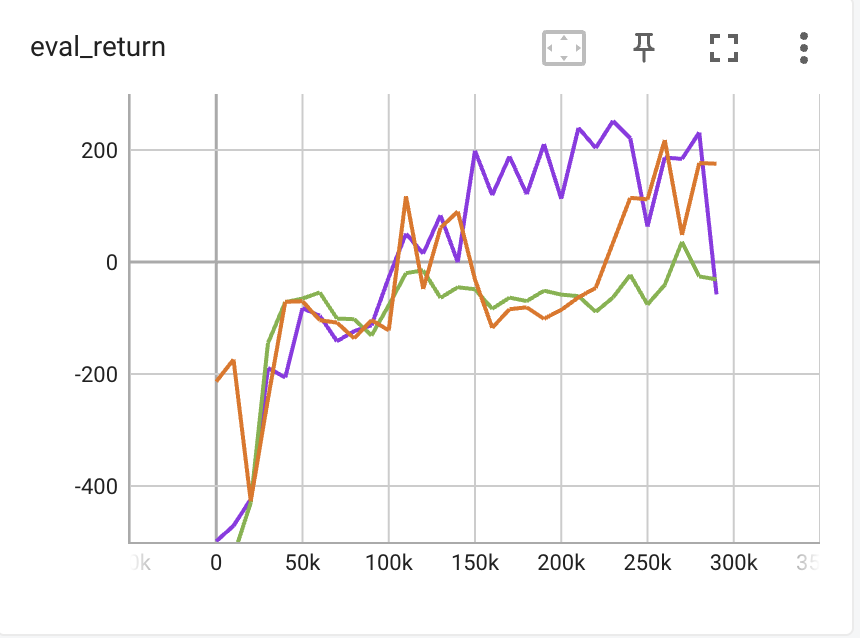
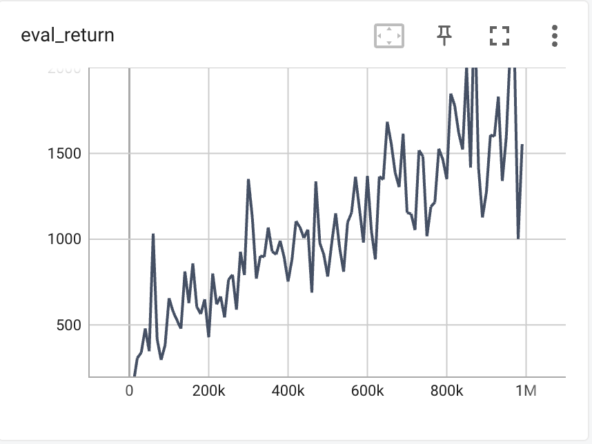

# DQN
## Basice Q-Learning
### Deliver 1: DQN on CartPole-v1
```shell
python cs285/scripts/run_hw3_dqn.py -cfg experiments/dqn/cartpole.yaml
```

### Deliver 2: DQN on LunarLander-v2
```shell
python cs285/scripts/run_hw3_dqn.py -cfg experiments/dqn/lunarlander.yaml --seed 1
python cs285/scripts/run_hw3_dqn.py -cfg experiments/dqn/lunarlander.yaml --seed 2
python cs285/scripts/run_hw3_dqn.py -cfg experiments/dqn/lunarlander.yaml --seed 3
```

## Double Q-Learning
### Deliver 3: Double DQN on lunar lander problem
```shell
python cs285/scripts/run_hw3_dqn.py -cfg experiments/dqn/lunarlander_doubleq.yaml --
    seed 1
python cs285/scripts/run_hw3_dqn.py -cfg experiments/dqn/lunarlander_doubleq.yaml --
    seed 2
python cs285/scripts/run_hw3_dqn.py -cfg experiments/dqn/lunarlander_doubleq.yaml --
    seed 3
```

### Deliver4: Double DQN on MsPacman-v0 problem.
```shell
python cs285/scripts/run_hw3_dqn.py -cfg experiments/dqn/mspacman.yaml
```

# Continuous Actions with Actor-Critic
### Bootstrapping
