## Problem 1
```shell
python cs285/scripts/run_hw4.py -cfg experiments/mpc/halfcheetah_0_iter.yaml
```
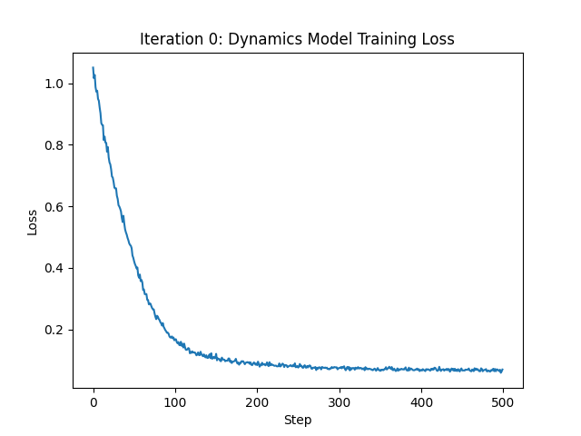

Change the hidden size to 64 and run again:

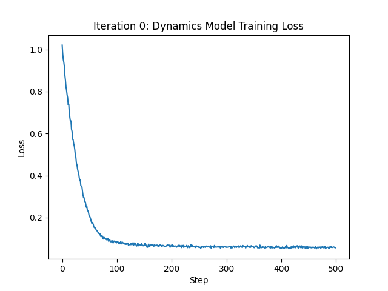

Change the num_layers to 4 and run again:

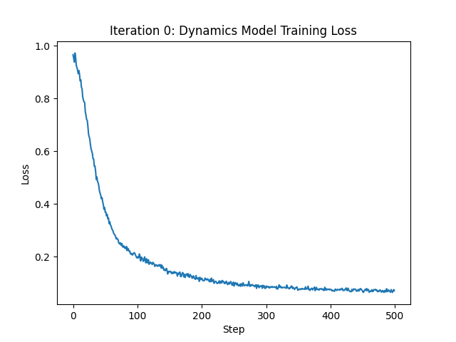
## Problem 2
```shell

python cs285/scripts/run_hw4.py -cfg experiments/mpc/obstacles_1_iter.yaml
```
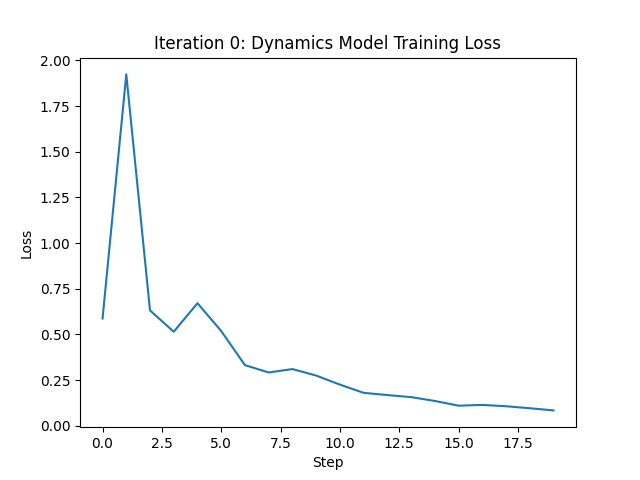

The eval_return value is -28.391082763671875.
## Problem 3
```shell
python cs285/scripts/run_hw4.py -cfg experiments/mpc/obstacles_multi_iter.yaml
```
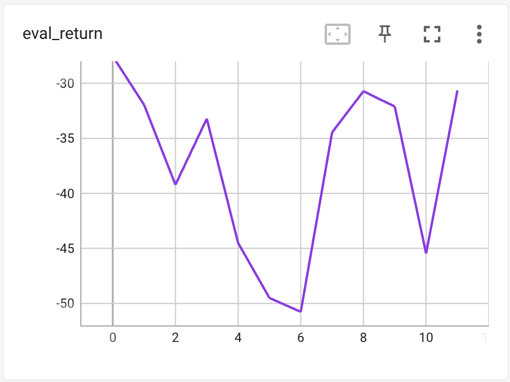
```shell
python cs285/scripts/run_hw4.py -cfg experiments/mpc/reacher_multi_iter.yaml
```
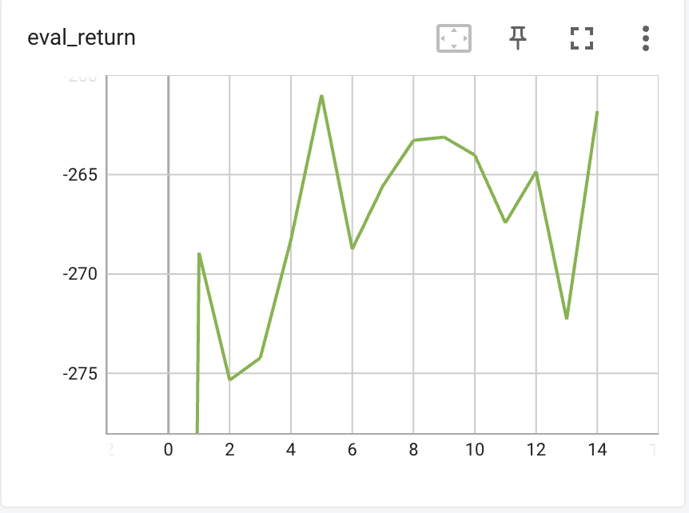
```shell
python cs285/scripts/run_hw4.py -cfg experiments/mpc/halfcheetah_multi_iter.yaml
```
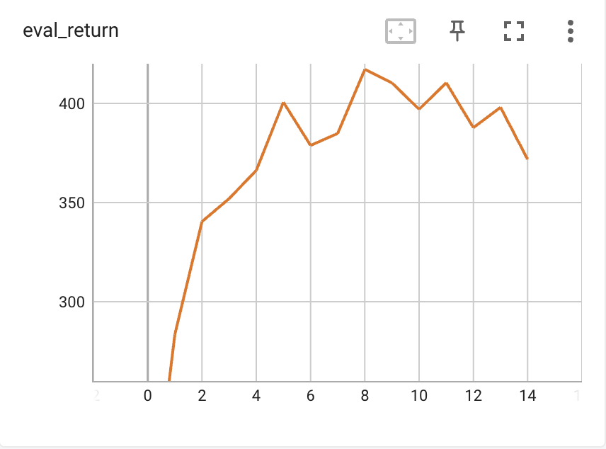
## Problem 4
### Ablation study on ensemble_size
```shell
python cs285/scripts/run_hw4.py -cfg experiments/mpc/reacher_ablation.yaml
```
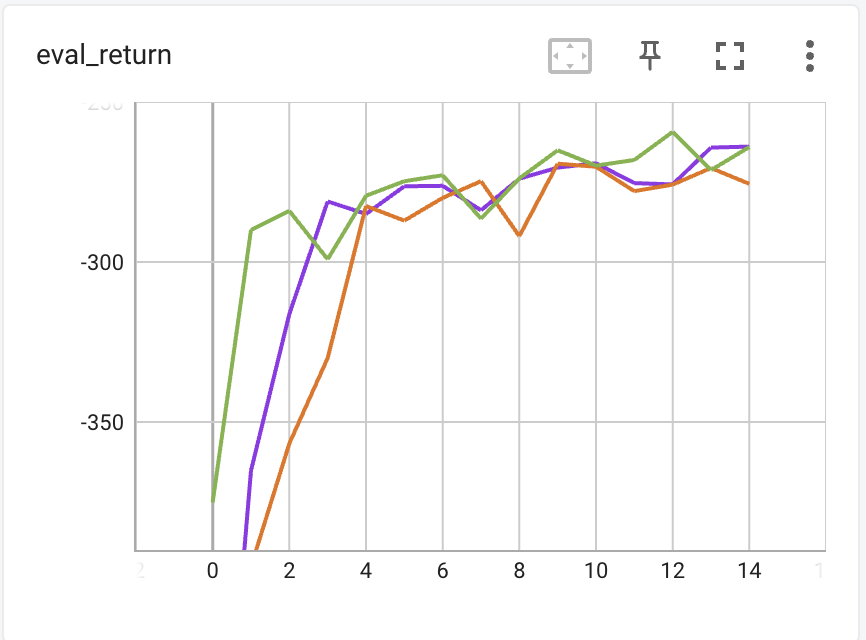
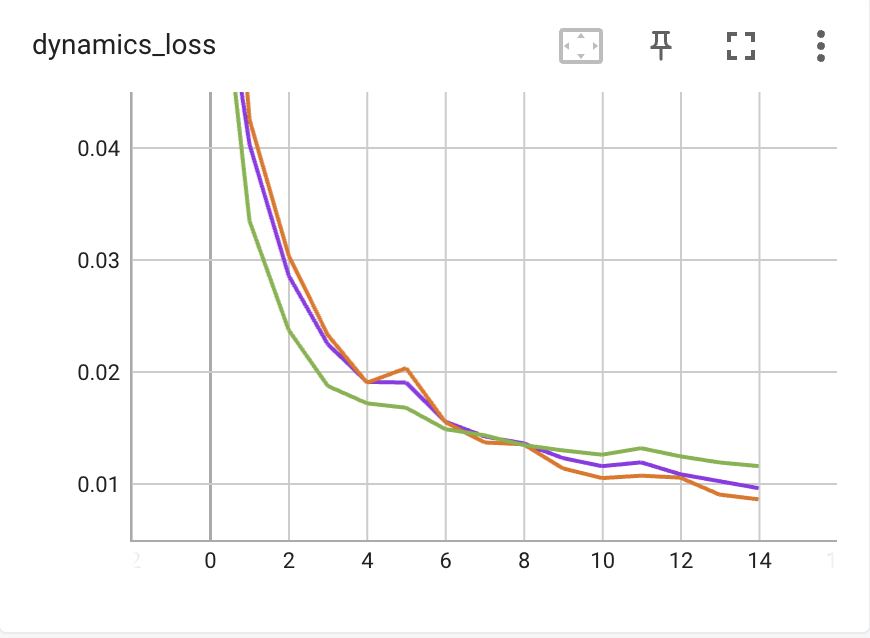
## Problem 5
```shell
python cs285/scripts/run_hw4.py -cfg experiments/mpc/halfcheetah_cem.yaml
```
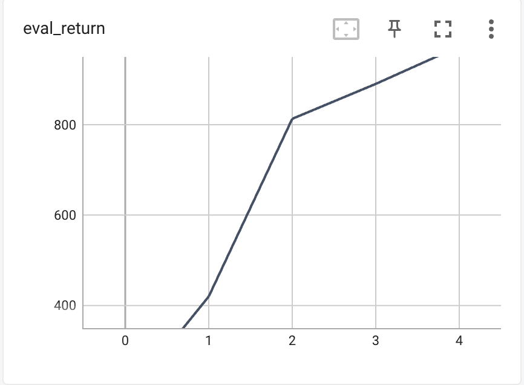
### Problem 6
```shell
python cs285/scripts/run_hw4.py -cfg experiments/mpc/halfcheetah_mbpo.yaml --sac_config_file experiments/sac/halfcheetah_clipq.yaml
```
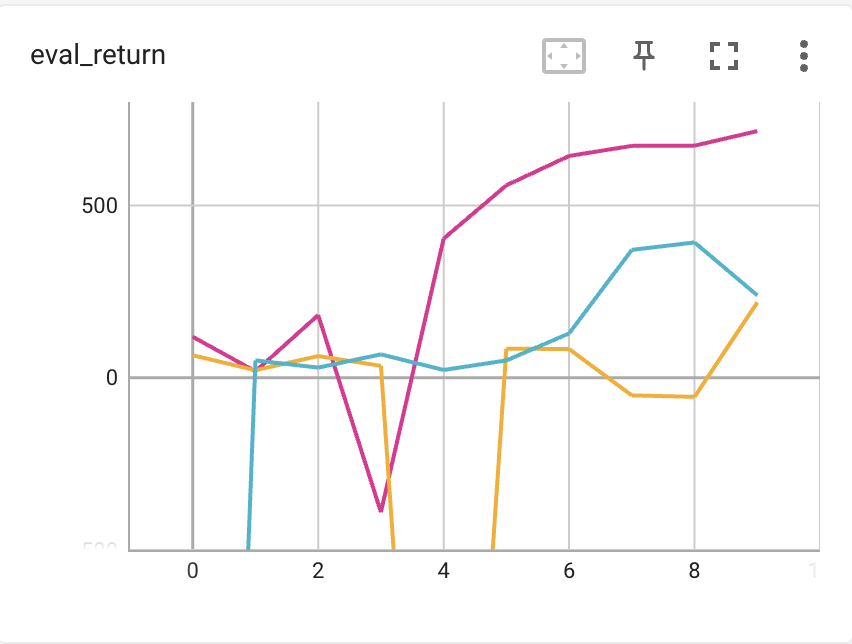

where purple represents rollout length of 10, yellow represents rollout length of 1 and blue represents rollout length of 0.
